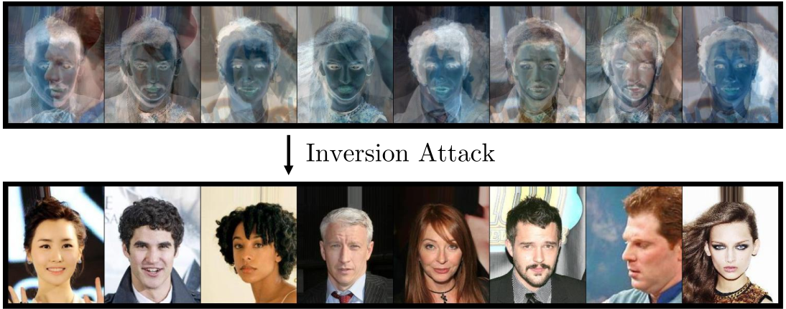

# Breaking DataMix

This is the implementation of the paper:

[**Breaking DataMix: Private Mixing Coefficients Can Be Recovered via Inversion Attacks**]( ) (2026)



Given a set of encoded images, our inversion attack successfully recovers the original private images used in the encoding process.

## Overview

Can random linear mixing be considered encryption?

[DataMix by Zhijian Liu et al.](https://www.ecva.net/papers/eccv_2020/papers_ECCV/papers/123560562.pdf)—a groundbreaking paper published at ECCV 2020 and led by Song Han from MIT— proposes a privacy-preserving edge–cloud inference framework in which images are encrypted by random linear mixing and further anonymized through inter-group shuffling before being uploaded to the cloud.

In this work, we present a powerful and practical attack that completely breaks both the mixing and shuffling mechanisms of DataMix.

Given only the mixed images received by the cloud, our method reconstructs the original private images with near-perfect accuracy — demonstrating that random linear mixing with private coefficients does **not** constitute a secure encryption scheme.

## Our Contributions

Beyond the proposed attacks, this repository includes two technical contributions:

### 1) T-ICA (Trained Independent Component Analysis)
A novel scalable neural approach to Independent Component Analysis that:
- Avoids adversarial training
- Scales to large source sets
- Enables efficient source separation in high dimensions

### 2) BBC (Balanced Blossom Clustering)
A hard-constrained balanced clustering algorithm based on Blossom matching that:
- Enforces equal-size clustering constraints
- Operates purely on pairwise distance matrices and does not require a vector-space representation
- Improves robustness under noisy distance matrices

## Notebook Structure

All implementations are provided in a single Jupyter notebook:

```
breaking_datamix.ipynb
```

### Outline

```
Setup
Dataset
Key-Recovery Attack
    ICA
    T-ICA
Group-Matching Attack
    Distance Matrix Computation
    Clustering Algorithm
```

## Environment & Dependencies

### Python
Python 3.10.13

### Platform
- Google Colab (GPU runtime enabled)
- Tested with NVIDIA T4 / L4 / A100 GPUs
- CUDA 12.4

### Library Versions

| Library        | Version |
|---------------|----------|
| torch         | 2.0.1 |
| torchvision   | 0.15.2 |
| numpy         | 1.24.4 |
| scipy         | 1.10.1 |
| scikit-learn  | 1.2.2 |
| opencv-python | 4.8.0.76 |
| cvxpy         | 1.3.2 |
| matplotlib    | 3.7.2 |

Install manually if needed:

```bash
pip install torch==2.0.1 torchvision==0.15.2 numpy==1.24.4 \
scipy==1.10.1 scikit-learn==1.2.2 opencv-python==4.8.0.76 \
cvxpy==1.3.2 matplotlib==3.7.2
```

## Running the Code

1. Open `breaking_datamix.ipynb` in Google Colab.
2. Enable GPU:
   - Runtime → Change runtime type → GPU
3. Run all cells sequentially.

## Reference

```bibtex
@article{breaking_datamix_2026,
  title={Breaking DataMix: Private Mixing Coefficients Can Be Recovered via Inversion Attacks},
  author={Anonymous},
  year={2026}
}
```

## Disclaimer

This repository is provided strictly for research and educational purposes.
It demonstrates security vulnerabilities in linear mixing–based privacy mechanisms.
